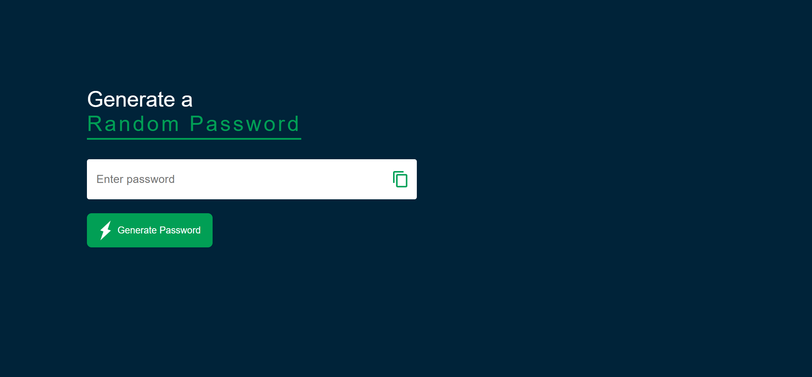

# Random Password Generator

A simple random password generator built with HTML, CSS and JavaScript.

> This project was built for practice purposes only

## Features

- Generates an 18-character password with uppercase, lowercase, numbers and symbols
- Copy to clipboard with one click

## Tech Stack

- HTML
- CSS
- Vanilla JavaScript
